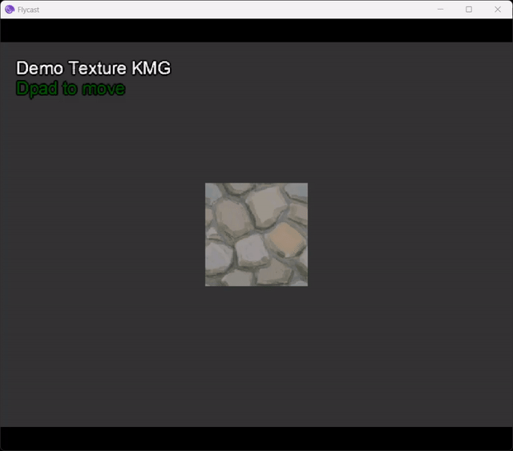
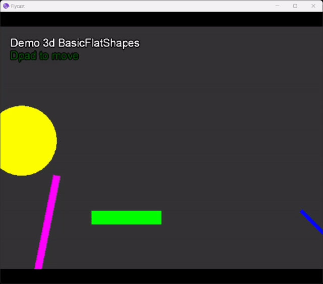
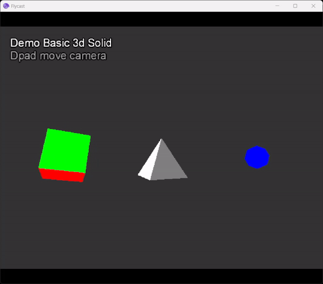
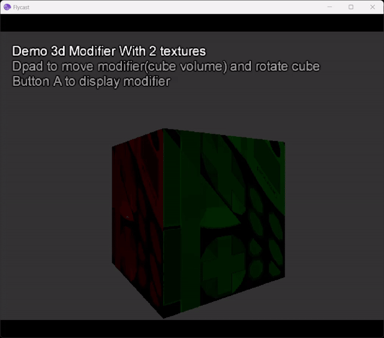
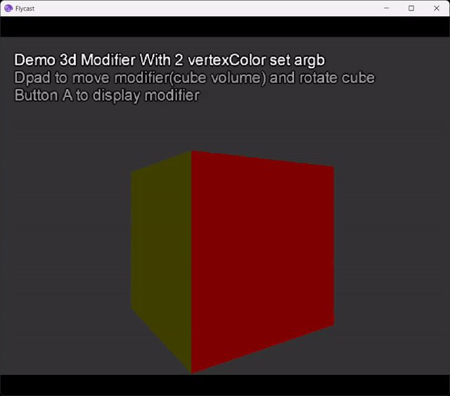
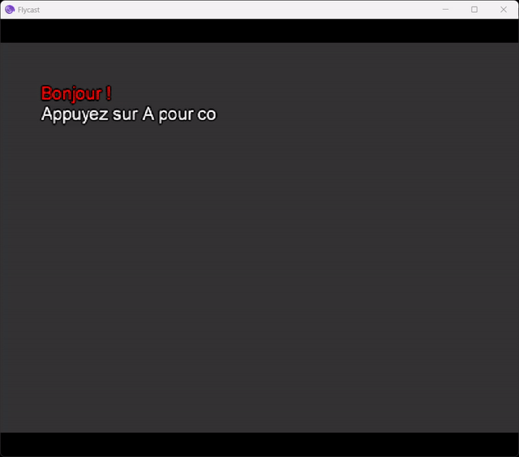
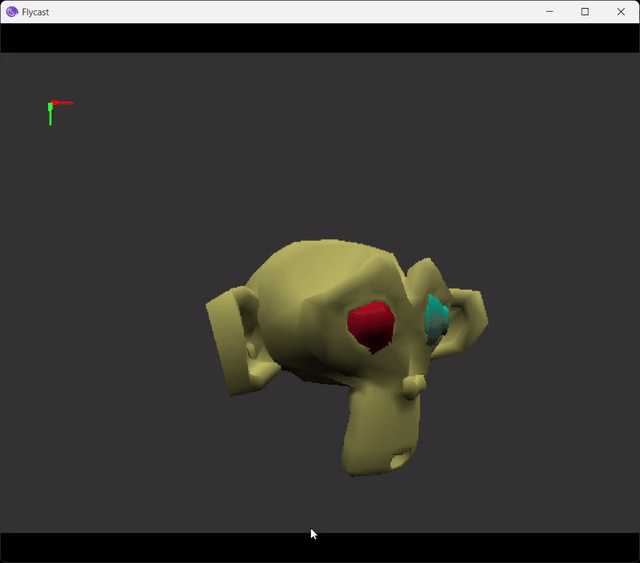
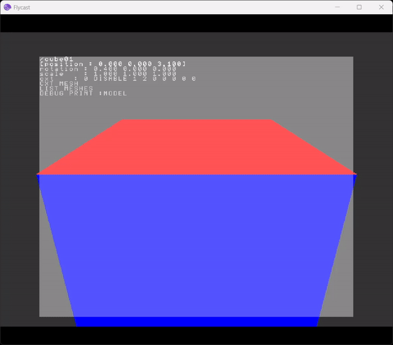

# TANTO

TANTO est un framework de développement pour la console Sega Dreamcast, construit sur KallistiOS (KOS) - un système de développement libre et open-source.


## Structure du Projet

```
/
├── TANTO/          # Fichiers sources du moteur
├── BUILD/          # Fichiers compilés
│   └── DEMO_XX/    # Fichiers compilés de SAMPLES/DEMO_XX
├── SAMPLES/        # Exemples de projets
│   └── DEMO_XX/    # Projets de démo
└── SCRIPTS/        # Scripts utilitaires
    ├── BLENDER             # Script de exportation format PVR pour les models3d avec animation
    ├── MAKECDI             # Script de compilation et de lancement
    ├── KRITA               # Scrips d'export layers
```

## Exemples 

 - Demo Basic Texture KMG 
 
 - Demo 3d Basic flat shapes
 
 - Demo 3d Base Geometry
 
 - Demo 3d cube with 3d volume modifier filtering 2 textures
 
 - Demo 3d cube with 3d volume modifier filtering 2 set of Vertex Color
 
 - Demo gui animated Text
 
 - Demo 3d model with animations exported from Blender using exporter 
 
 - Demo tiny debugger
 

## Prérequis

- KallistiOS (KOS) v2.0+
- Compilateur kos-cc
- Bibliothèques additionnelles pour son et vidéo (requis ultérieurement)

## Installation & Configuration

### Windows
- Recommandé : Utiliser wsl et une installation kos linux https://github.com/KallistiOS/KallistiOS ou  Installer DreamSDK depuis https://github.com/dreamsdk

### Linux/macOS
- Suivre le guide d'installation sur https://github.com/KallistiOS/KallistiOS

Configurer le chemin de l'émulateur dans `SCRIPTS/makeCdiAndRun.sh`:
```bash
flycast_path="chemin/vers/votre/emulateur/dreamcast"
```

## Utilisation

1. Exécuter `make` à la racine
2. Naviguer vers `/BUILD/DEMO_XX/`
3. Lancer :
   - Windows avec DreamSDK : `run.bat`
   - Linux/macOS/WSL : `makeCdiAndRun.sh`

Compilation rapide : Exécuter `make` dans n'importe quel dossier de projet pour une compilation et un lancement automatique.

## Résolution des problèmes

- "KOS not found" : Vérifier les variables d'environnement KOS
- Erreur de compilation : Vérifier la version de kos-cc
- L'émulateur ne démarre pas : Vérifier le chemin dans makeCdiAndRun.sh

## Documentation

Wiki et tutoriels prochainement disponibles !

## Licence

Apache License 2.0