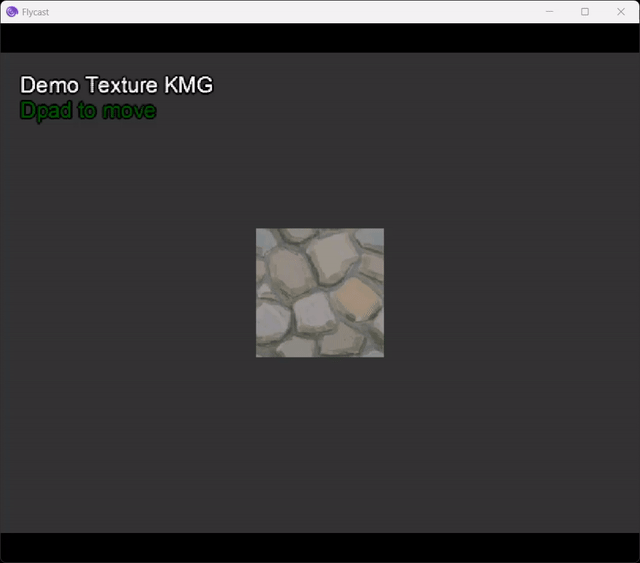
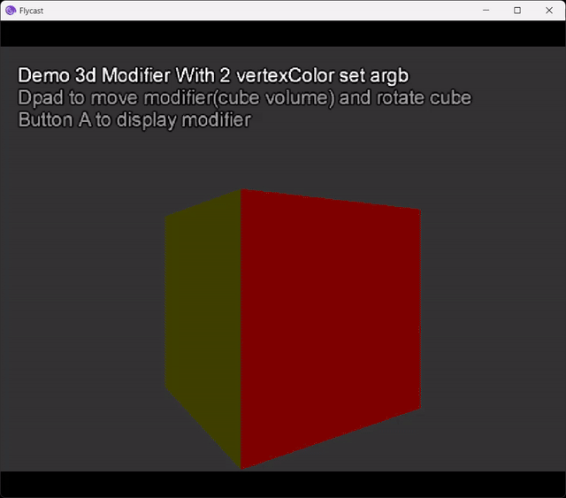
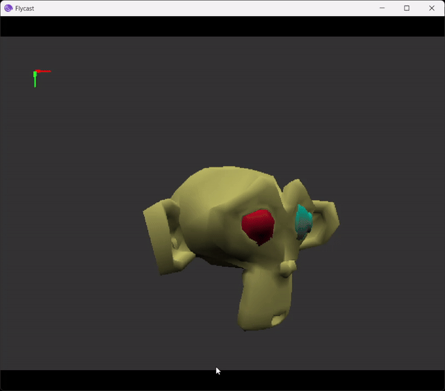

*Read this in other languages: [Français](README.fr.md)*

# TANTO

TANTO is a development framework for the Sega Dreamcast console, built on KallistiOS (KOS) - a free and open-source development system.


## Project Structure

```
/
├── TANTO/          # Engine source files
├── BUILD/          # Compiled files
│   └── DEMO_XX/    # Compiled files from SAMPLES/DEMO_XX
├── SAMPLES/        # Example projects
│   └── DEMO_XX/    # Demo projects
└── SCRIPTS/        # Utility scripts
    ├── BLENDER             # PVR format export script for 3D models with animation
    ├── MAKECDI             # Compilation and launch script
    ├── KRITA               # Layer export scripts
```

## Examples

- Demo Basic Texture KMG
- Demo 3D Basic flat shapes
- Demo 3D Base Geometry
- Demo 3D cube with 3D volume modifier filtering 2 textures
- Demo 3D cube with 3D volume modifier filtering 2 sets of Vertex Color
- Demo GUI animated Text
- Demo 3D model with animations exported from Blender using exporter
- Demo tiny debugger

<p align="center">
  
   
  

  
  
  

  
  
</p>

## Prerequisites

- KallistiOS (KOS) v2.0+
- kos-cc compiler
- Additional KMG libraries for files converted to kmg format.

## Installation & Configuration

### Windows
- Recommended: Use WSL and a Linux KOS installation https://github.com/KallistiOS/KallistiOS or install DreamSDK from https://github.com/dreamsdk

### Linux/macOS
- Follow the installation guide at https://github.com/KallistiOS/KallistiOS

Configure the emulator path in `SCRIPTS/MAKECDI/makeCdiAndRun.sh`:
```bash
flycast_path="path/to/your/dreamcast/emulator"
```

Edit file ~/.bashrc with `source /opt/toolchains/dc/kos/environ.sh`

## Usage

1. Run `make` at the root
2. Navigate to `/BUILD/DEMO_XX/`
3. Launch:
   - Windows with DreamSDK: `run.bat`
   - Linux/macOS/WSL: `makeCdiAndRun.sh`

Full compilation: Simply run `make` at the root /TANTO_ENGINE

Quick compilation: Run `make clean` then `make` in any project folder for automatic compilation and launch.

If the demo has already been compiled, run `make run` to avoid recompiling the project and just launch the program in the emulator (preferably flycast)

## Troubleshooting

- "KOS not found": Check KOS environment variables
- Compilation error: Check kos-cc version
- Emulator doesn't start: Check the path in makeCdiAndRun.sh

## Documentation

Wiki and tutorials coming soon!

## License

Apache License 2.0